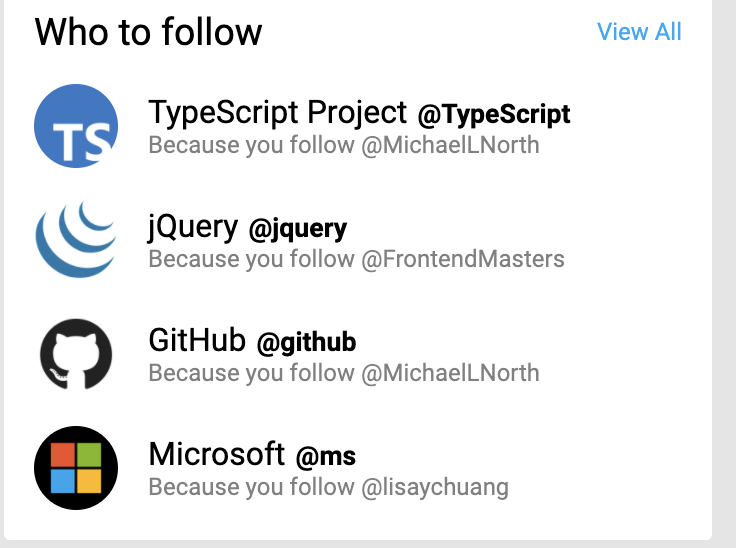

Open `server/src/resolvers/Query.ts` and replace the fixture array in `suggestions()` with a call
to the db.

```ts
  suggestions: (_, __, { db }) => {
    return db.getAllSuggestions();
  },
```

And do something similar for `currentUser`, using the first user in the DB as the "current one"

```ts
currentUser: (_, __, { db }) => {
  const [firstUser] = db.getAllUsers();
  if (!firstUser)
    throw new Error(
      'currentUser was requested, but there are no users in the database'
    );
  return firstUser;
},
```

Save everything, and you should now see **four suggestions** in the UI


Next, let's deal with **nested data** in two different situations
